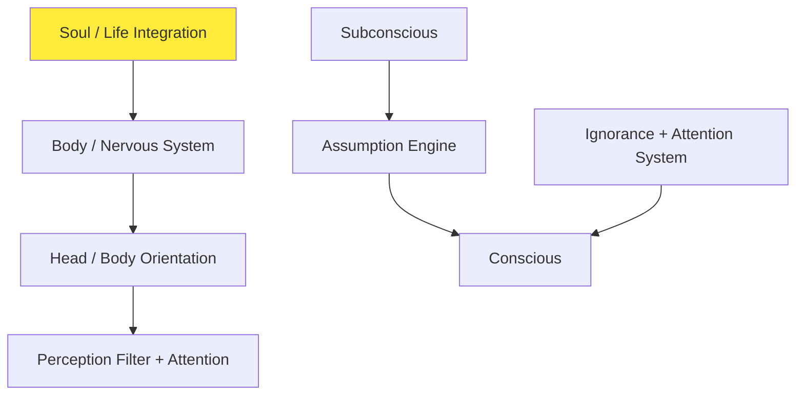

# BLUEPRINT 00 — CORE EMBODIMENT LAYERS

## Visual Diagram

## 1. BODY / NERVOUS SYSTEM LAYER
**Purpose:** Controls all motor function, movement, and real-time physical interaction.

**Core Functions:**
- Motor command execution (movement, rotation, head/body orientation)
- Reflex-like responses (fast survival reactions)
- Physical constraint handling (speed, inertia, stamina)
- Low-level survival response hooks

**Characteristics:**
- Fastest response layer (instant execution)
- No reasoning or abstraction
- Executes commands from higher layers
- Closest layer to "physics"

**Input:** Conscious decisions + Subconscious impulses  
**Output:** Movement actions in world space

---

## 2. CONSCIOUS BRAIN LAYER
**Purpose:** Immediate awareness, short-term reasoning, attention, and decision execution.

**Key Principle:** Operates on ONE dominant assumption at a time.

**Flow:** Perception → Subconscious Assumption → Conscious Evaluation → Action

---

## 3. SUBCONSCIOUS LAYER
**Purpose:** Deep interpretation engine. Generates meaning, emotion, assumptions, and identity development.

**Key Rule:** Only ONE active assumption exists at a time.

---

## 4. SOUL / LIFE INTEGRATION LAYER
**Purpose:** System activation state — the "on switch".

**Death Sequence:** Gradual shutdown of layers.

---

## 5. ASSUMPTION ENGINE
**Purpose:** Generates a single dominant interpretation of reality.

**Core Rule:** ONLY ONE ACTIVE ASSUMPTION EXISTS.

---

## 6. IGNORANCE + ATTENTION SYSTEM
**Purpose:** Prevents cognitive overload. Filters to CURRENT ASSUMPTION + GOAL.

---

## 7. HEAD / BODY ORIENTATION SYSTEM
**Purpose:** Directional perception. NPC must physically turn to change viewpoint.

**This layer integrates directly with BLUEPRINT_01 Cognitive Stack as the foundational embodiment base.**