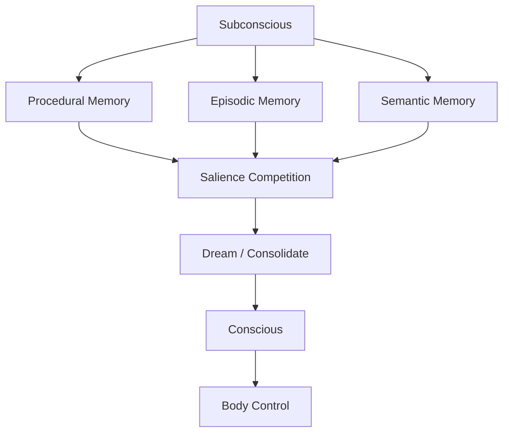

# BLUEPRINT V1

## Visual Diagram

```mermaid
flowchart TD
    A[Subconscious] --> B[Procedural Memory]
    A --> C[Episodic Memory]
    A --> D[Semantic Memory]
    B & C & D --> E[Salience Competition]
    E --> F[Dream / Consolidate]
    F --> G[Conscious]
    G --> H[Body Control]
```

[Original ASCII diagram here]